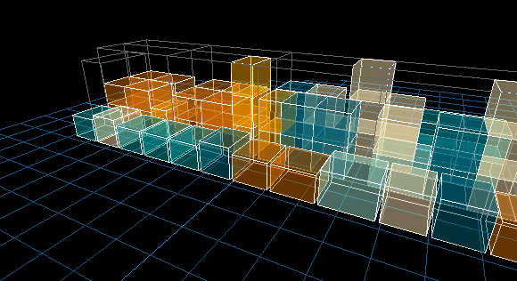
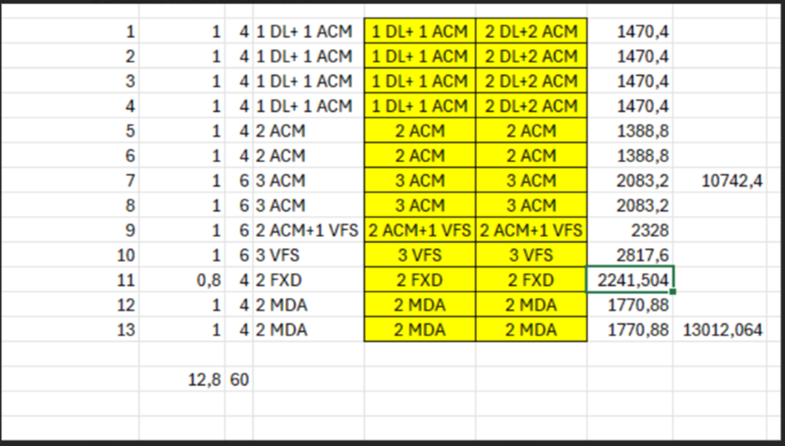

Playful task of loading a transparent truck with colorful containers.



```bash
bun install # install dependencies
bun calculation.ts # generate `output.json` but still strongly under development! 🐣
bun run vite # display the results
```

I’ve actually never had the chance to play with [three.js](https://threejs.org/), but I have to say, I really like what I've seen so far.

Reading materials:
[The Art of Stacking: Challenges Faced While Developing a Packing Algorithm | by Sawa_i](https://medium.com/@fayyazawais1412/the-art-of-stacking-challenges-faced-while-developing-a-packing-algorithm-64d869b924ab)

Tuesday packing plan:
